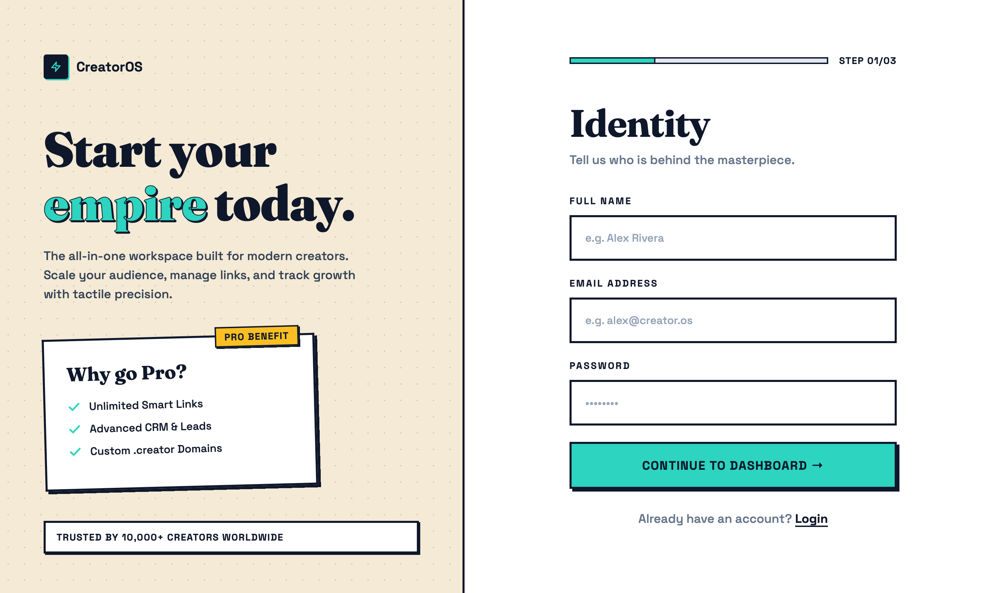
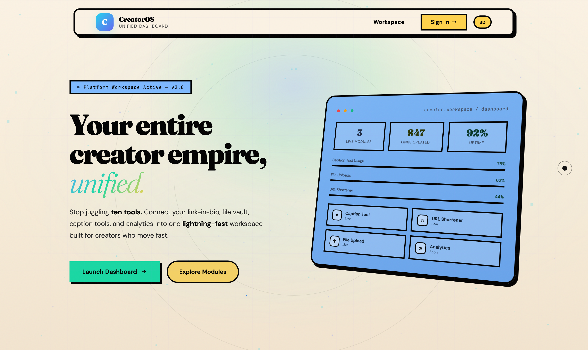
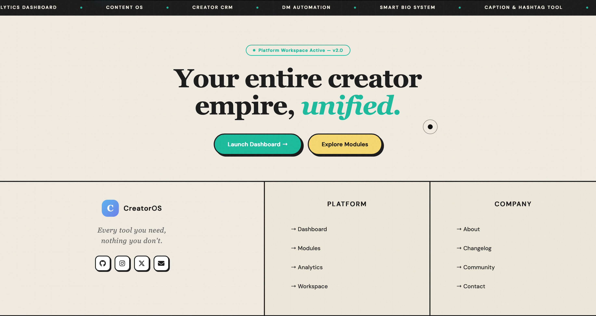

# CreatorOS Design System (AI Agent & Contributor Guide)

> **CRITICAL INSTRUCTION FOR AI AGENTS & DEVELOPERS:**
> When asked to "design", "build", or "redesign" ANY page or component for CreatorOS, you **MUST** strictly adhere to the rules, variables, and structural paradigms in this document. Do not use generic Tailwind components, default Bootstrap, or standard modern web styling (like soft blurred shadows). 
> **You are building a highly tactile, bold, high-contrast, physical-feeling interface.**

---

## 1. The Core Aesthetic Paradigm
The CreatorOS aesthetic is defined by its "physicality". Every element on the page (cards, buttons, navbars, inputs) should feel like a physical sticker or cardboard cutout placed on a desk. 

**Key Visual Signatures:**
1. **Aggressive High Contrast:** Pitch-black borders (`#0F172A`) around almost every UI element.
2. **Hard Shadows:** Drop shadows are **never** blurred. They are solid blocks of color.
3. **Tactile Interactivity:** When you hover over a button, it physically moves up and left, and its shadow grows. When clicked, it presses down.
4. **Typography Clash:** Elegant, chunky Serif (`Fraunces`) for massive display headings, clashing with a highly technical, geometric Sans-Serif (`Space Grotesk`) for UI and data.
5. **Vibrant Accents:** The background is a soft Cream, but UI components aggressively use bright Teal, Yellow, and Blue.

---

## 2. The Master CSS Variables
Every stylesheet or `<style>` block generated for CreatorOS **MUST** include and use these exact variables:

```css
:root {
    /* 1. Core Color Palette */
    --cream: #F4EAD5;      /* The base background color for the entire app */
    --white: #FFFFFF;      /* Background for forms, cards, and input fields */
    --black: #0F172A;      /* Text, borders, shadows, and icons */
    
    /* 2. Vibrant Accent Colors */
    --teal: #2DD4BF;       /* Primary CTA buttons, highlight text, active states */
    --yellow: #FBBF24;     /* Secondary buttons, "Pro" badges, warning states */
    --blue: #60A5FA;       /* Tertiary accent, often used for graphical UI cards */
    
    /* 3. Tactile Borders & Geometry */
    --border-width: 3px;   /* Standard border thickness for EVERYTHING */
    
    /* 4. The Unblurred Shadows (Crucial for the theme) */
    --shadow-solid: 4px 4px 0px 0px var(--black);
    --shadow-hover: 6px 6px 0px 0px var(--black);
    --shadow-active: 2px 2px 0px 0px var(--black);
}

* {
    box-sizing: border-box;
    margin: 0;
    padding: 0;
}

body {
    background-color: var(--cream);
    color: var(--black);
}
```

---

## 3. Typography Rules

You **must** import these Google Fonts at the top of your document:
`<link href="https://fonts.googleapis.com/css2?family=Fraunces:opsz,wght@9..144,700;9..144,900&family=Space+Grotesk:wght@400;500;600;700&display=swap" rel="stylesheet">`

### 3.1 Display & Headings (`h1`, `h2`, `h3`)
* **Font Family:** `'Fraunces', serif`
* **Weight:** `700` to `900` (Extra Bold/Black)
* **Letter Spacing:** `-1px` to `-2px` (Tight tracking)
* **Usage:** Only for page titles, hero text, and major section dividers.
* **Highlighting Trick:** To emphasize a word in a heading, wrap it in a `<span>`, color it `--teal`, and optionally italicize it.

### 3.2 UI, Body & Data (`p`, `input`, `button`, `label`)
* **Font Family:** `'Space Grotesk', sans-serif`
* **Weight:** `500` to `700`
* **Usage:** Literally everything else. Form inputs, labels, button text, paragraph copy, navigation links.
* **UI Labels:** Always uppercase, bold, with heavy tracking (`letter-spacing: 1px; text-transform: uppercase; font-size: 0.875rem;`).

---

## 4. Component Blueprints (AI Generation Guide)

When generating UI components, adhere strictly to these physical properties:

### 4.1 Buttons & CTAs
Buttons are thick blocks. Some are rectangular, some are pill-shaped (`border-radius: 9999px`).
```css
.btn-primary {
    background-color: var(--teal);
    color: var(--black);
    border: var(--border-width) solid var(--black);
    box-shadow: var(--shadow-solid);
    font-family: 'Space Grotesk', sans-serif;
    font-weight: 700;
    text-transform: uppercase;
    padding: 1rem 2rem;
    transition: all 0.15s ease;
    cursor: pointer;
}

/* The tactile hover interaction */
.btn-primary:hover {
    transform: translate(-2px, -2px);
    box-shadow: var(--shadow-hover);
}

.btn-primary:active {
    transform: translate(2px, 2px);
    box-shadow: var(--shadow-active);
}
```

### 4.2 Cards & Floating Windows
Cards hold content, features, or data. They should look like physical paper floating above the background.
* **Border:** `var(--border-width) solid var(--black)`
* **Background:** `var(--white)` (or sometimes `--cream` if nested)
* **Shadow:** `var(--shadow-solid)`
* **Quirk:** For marketing elements (like a "Why go Pro?" box), apply a slight rotation (`transform: rotate(-1.5deg);`) to make it look manually placed.

### 4.3 Navbars (Pill Style)
The main navigation is not a full-width block. It is a floating "pill" centered at the top of the screen.
* **Shape:** `border-radius: 9999px;`
* **Structure:** `display: flex; align-items: center; justify-content: space-between;`
* **Style:** `background: var(--white); border: var(--border-width) solid var(--black); box-shadow: var(--shadow-solid); padding: 0.75rem 1.5rem;`

### 4.4 Form Inputs & Labels
Forms must be highly legible and brutal. No floating labels. No soft borders.
* **Labels:** Above the input. `font-weight: 700; text-transform: uppercase; letter-spacing: 1.5px;`
* **Inputs:** `border: var(--border-width) solid var(--black); background: var(--white); padding: 1.25rem; font-family: 'Space Grotesk';`
* **Focus State:** `box-shadow: var(--shadow-solid); transform: translate(-2px, -2px); outline: none;`

### 4.5 Background Textures
To break up solid colors, use a CSS radial-gradient dot grid on `--cream` backgrounds (especially in split-screen left panels).
```css
.dot-grid-bg {
    background-color: var(--cream);
    background-image: radial-gradient(#d1c7b5 1px, transparent 1px);
    background-size: 24px 24px;
}
```

---

## 5. Standard Page Layouts

When creating a new page, use one of these macro-layouts and reference the corresponding screenshot.

1. **The Login Page Identity (Auth, Settings, Vault Focus)**
   * `display: flex; min-height: 100vh;`
   * **Left (1fr):** Dot-grid cream background, massive Fraunces text, rotating feature cards.
   * **Right (1.2fr):** Solid white background, housing the main interaction form or data table.
   
   

2. **The Floating Dashboard Hero**
   * Full screen `--cream` background.
   * A floating pill-shaped Navbar at the top.
   * Center-aligned massive text with italicized `--teal` highlights.
   * Asymmetric floating UI cards acting as graphic elements (e.g., the blue dashboard card).
   
   

3. **Dashboard Content & Footers (Analytics, CRM, Link Management)**
   * Section dividers are thick black lines (`border-top: 2px solid var(--black);`).
   * Clean grid structures for menus and links.
   * Hover effects on links using `--teal` highlighting.
   
   

---

## AI PROMPT INJECTION SUMMARY
**If you are an AI generating code based on this file:**
You are forbidden from using `border-radius: 0.5rem`, `box-shadow: 0 4px 6px rgba(...)` (blurred), or generic muted grays. Every border must be `3px solid #0F172A`. Every shadow must be a sharp, unblurred offset (`4px 4px 0px 0px #0F172A`). Use `Fraunces` for titles, `Space Grotesk` for data. Follow these rules flawlessly to output a perfect CreatorOS UI.
